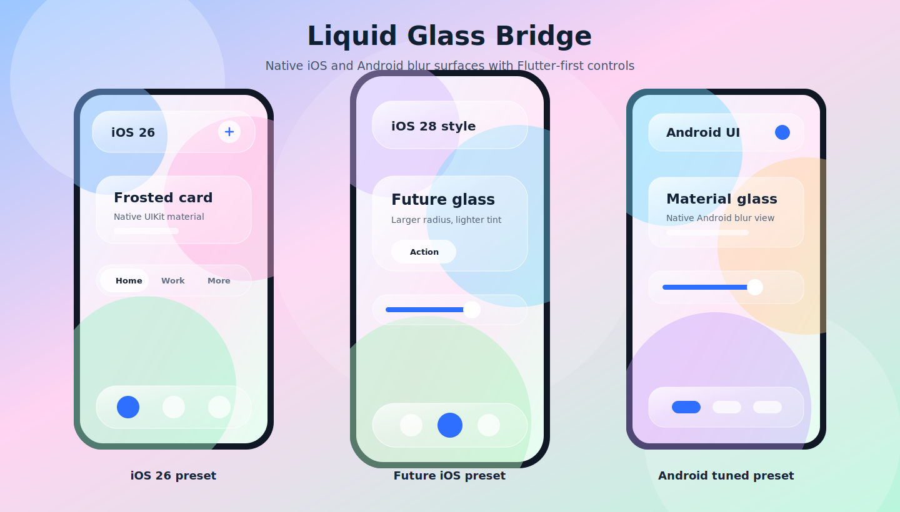

# liquid_glass_bridge

A cross-platform Flutter package that gives you one API for liquid-glass UI.



- **iOS**: native Swift/UIKit renderer (`UIVisualEffectView`) for system-like frosted material, with iOS 26-inspired and future-style presets.
- **Android**: native blur renderer with Android-tuned glass UI presets.
- **Web/Desktop**: Flutter renderer (`BackdropFilter` + tint + border + highlight + optional noise).
- **Lens mode**: shader overlay with automatic fallback.

## Why Liquid Glass Bridge?

- Small focused API for glass surfaces and controls instead of a full app framework.
- Native-backed blur on both iOS and Android, with Flutter fallbacks for web and desktop.
- iOS-inspired, future-style, and Android-tuned presets from the same theme.
- Glass controls that keep Flutter gestures, semantics, and theming.

## Install

```bash
flutter pub add liquid_glass_bridge
```

## Platform Setup (iOS and Android)

`liquid_glass_bridge` is auto-wired by Flutter plugins, but apps should verify
these minimum platform settings:

### iOS

1. Set iOS deployment target to `13.0` or newer.

```ruby
# ios/Podfile
platform :ios, '13.0'
```

2. Refresh CocoaPods after changing deployment targets:

```bash
cd ios && pod install
```

3. Use `LiquidGlassMode.auto` (recommended) or `LiquidGlassMode.iosNative` to
   force UIKit rendering.
4. No extra iOS permissions are required.

### Android

1. Set Android minimum SDK to `21` or newer in your app module.

```gradle
// android/app/build.gradle
defaultConfig {
    minSdkVersion 21
}
```

2. Use `LiquidGlassMode.auto` (recommended) or
   `LiquidGlassMode.androidNative` to force the native Android blur view.
3. No extra Android permissions are required.

If your Gradle setup cannot resolve `BlurView`, add JitPack to repositories:

```gradle
allprojects {
    repositories {
        maven { url 'https://jitpack.io' }
    }
}
```

## Included Widgets

- `LiquidGlassSurface`
- `LiquidGlassButton`
- `LiquidGlassIconButton`
- `LiquidGlassSegmentedControl`
- `LiquidGlassSwitch`
- `LiquidGlassSlider`
- `LiquidGlassNavigationBar`
- `LiquidGlassBottomNavigationBar`

## Modes and Quality

### `LiquidGlassMode`

- `auto`: iOS -> native UIKit, Android -> native blur view, others -> Flutter glass
- `iosNative`: iOS native, others fallback to Flutter glass
- `androidNative`: Android native blur, others fallback to Flutter glass
- `flutterGlass`: force Flutter glass everywhere
- `flutterLens`: force lens shader (falls back to glass when unavailable)

### `LiquidGlassQuality`

- `low`: better performance
- `medium`: balanced (default)
- `high`: stronger effect, higher cost

## Main Surface API

`LiquidGlassSurface` parameters:

- `child`
- `borderRadius`
- `padding`, `margin`
- `elevation`
- `tintColor`, `tintOpacity`
- `blurSigma`
- `borderColor`, `borderWidth`
- `highlightStrength`
- `noiseOpacity`
- `iosBlurStyle`
- `style`, `platformStyle`
- `mode`
- `quality`
- `enabled`
- `debugLabel`

## Usage

### Surface

```dart
LiquidGlassSurface(
  mode: LiquidGlassMode.auto,
  quality: LiquidGlassQuality.medium,
  borderRadius: BorderRadius.circular(24),
  blurSigma: 18,
  noiseOpacity: 0.05,
  child: const Text('Liquid glass'),
)
```

### Controls

```dart
LiquidGlassSegmentedControl<int>(
  children: const <int, Widget>{
    0: Text('Day'),
    1: Text('Week'),
    2: Text('Month'),
  },
  groupValue: 0,
  onValueChanged: (int value) {},
)

LiquidGlassSwitch(
  value: true,
  onChanged: (bool value) {},
)

LiquidGlassSlider(
  value: 0.45,
  onChanged: (double value) {},
)
```

## Styles and Presets

Use `LiquidGlassStyle` for reusable visual settings. When `style` or
`platformStyle` is provided, those values override the per-parameter defaults.

```dart
final LiquidGlassStyle style = LiquidGlassPresets.frosted;

LiquidGlassSurface(
  style: style,
  child: const Text('Reusable style'),
)
```

## Theming

You can set app-wide defaults with `LiquidGlassTheme`. When a theme is present,
widgets will prefer its `style/platformStyle` and default `mode/quality`.
Per-widget overrides should use `style` or `platformStyle`.

```dart
LiquidGlassTheme(
  data: LiquidGlassThemeData(
    style: LiquidGlassPresets.frosted,
    mode: LiquidGlassMode.auto,
    quality: LiquidGlassQuality.medium,
  ),
  child: MaterialApp(
    home: const ExampleScreen(),
  ),
)
```

Platform-specific overrides:

```dart
final LiquidGlassPlatformStyle platformStyle = LiquidGlassPlatformStyle(
  fallback: LiquidGlassPresets.frosted,
  ios: LiquidGlassPresets.thin.copyWith(
    iosBlurStyle: LiquidGlassIosBlurStyle.systemThinMaterial,
  ),
  android: LiquidGlassPresets.dense.copyWith(blurSigma: 22),
);

LiquidGlassSurface(
  platformStyle: platformStyle,
  child: const Text('Per-platform glass'),
)
```

Adaptive iOS/Android presets:

```dart
LiquidGlassTheme(
  data: const LiquidGlassThemeData(
    platformStyle: LiquidGlassPresets.adaptive,
  ),
  child: MaterialApp(
    home: const ExampleScreen(),
  ),
)
```

Use `LiquidGlassPresets.adaptive` for iOS 26-inspired glass on iOS and
Android-tuned glass on Android. Use `LiquidGlassPresets.adaptiveFuture` to opt
iOS into a larger-radius, lighter future-style treatment while keeping the
Android UI tuned for Material surfaces.

iOS 26 component-style presets are also included:

```dart
LiquidGlassSurface(
  style: LiquidGlassPresets.ios26Pill,
  child: const Text('Command bar'),
)

LiquidGlassButton(
  style: LiquidGlassPresets.ios26Icon,
  borderRadius: BorderRadius.circular(999),
  padding: const EdgeInsets.all(18),
  onPressed: () {},
  child: const Icon(Icons.refresh),
)
```

For circular iOS 26-style toolbar buttons, prefer the dedicated widget:

```dart
LiquidGlassIconButton(
  icon: Icons.arrow_upward_rounded,
  borderRadius: BorderRadius.circular(999),
  padding: const EdgeInsets.all(18),
  onPressed: () {},
)
```

Every preset is just a `LiquidGlassStyle`, so you can tune `borderRadius`,
`tintColor`, `tintOpacity`, `blurSigma`, `borderColor`, `borderWidth`,
`highlightStrength`, `noiseOpacity`, `elevation`, and `iosBlurStyle` globally
or per widget. If you pass `style: LiquidGlassStyle(...)`, that is a complete
style; to keep a preset and change one value, use
`LiquidGlassPresets.ios26Icon.copyWith(...)`.

### Button + Navigation

```dart
Scaffold(
  appBar: const LiquidGlassNavigationBar(
    title: Text('Home'),
  ),
  bottomNavigationBar: LiquidGlassBottomNavigationBar(
    items: const <LiquidGlassNavItem>[
      LiquidGlassNavItem(icon: Icons.home_outlined, label: 'Home'),
      LiquidGlassNavItem(icon: Icons.search_outlined, label: 'Search'),
    ],
    currentIndex: 0,
    onTap: (int index) {},
  ),
  body: Center(
    child: LiquidGlassButton(
      onPressed: () {},
      child: const Text('Continue'),
    ),
  ),
)
```

## iOS Native Rendering Notes

On iOS, `auto` and `iosNative` use a platform view backed by Swift/UIKit:

- native blur material (`UIVisualEffectView`)
- native tint/border/highlight composition
- Flutter `child` content remains in Dart above the native layer
- `blurSigma` is ignored for native iOS; use `iosBlurStyle` instead

The iOS presets are visual approximations over stable public UIKit materials.
They are safe to run on newer iOS versions without requiring SDK-specific
private APIs, but they do not promise a pixel-perfect clone of private Apple
system surfaces.

On Android, `auto` and `androidNative` use a platform view backed by a native
blur view. If you need to force the Flutter renderer, set `mode` to
`flutterGlass`.

> Note: Android native blur uses the `BlurView` library under the hood.

## Performance Tips (Android/Flutter renderer)

- Keep `blurSigma` moderate (`12-18` is a good start).
- Use `LiquidGlassQuality.low` for long scrolling lists.
- Keep `noiseOpacity` subtle (`0.02-0.06`).
- Avoid many overlapping large blurred surfaces.

## Example App

Run from package root:

```bash
flutter run -d <device> -t example/lib/main.dart
```

or from `example/`:

```bash
flutter run
```

## License

MIT
